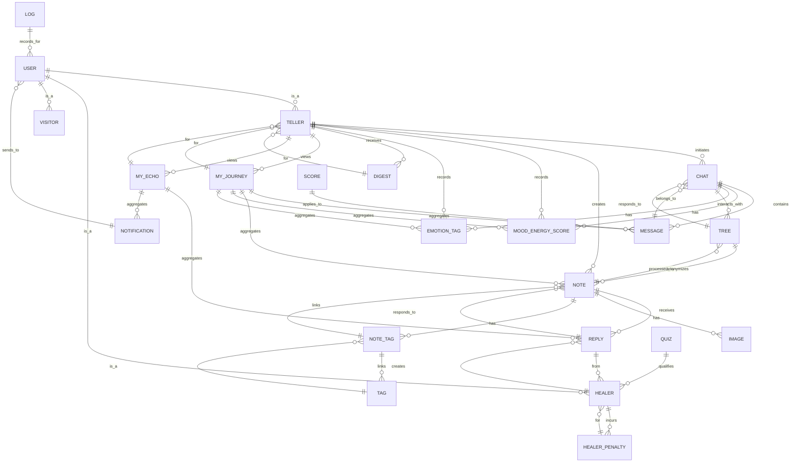

# Echo-Tree erDiagram

```mermaid
erDiagram
    USER ||--o{ TELLER : is_a
    USER ||--o{ HEALER : is_a
    USER ||--o{ VISITOR : is_a

    TELLER ||--o{ CHAT : initiates
    TELLER ||--o{ NOTE : creates
    TELLER ||--o{ MOOD_ENERGY_SCORE : records
    TELLER ||--o{ EMOTION_TAG : records
    TELLER ||--o{ DIGEST : receives
    TELLER ||--o{ MY_JOURNEY : views
    TELLER ||--o{ MY_ECHO : views

    HEALER ||--o{ REPLY : creates
    HEALER ||--o{ HEALER_PENALTY : incurs

    CHAT ||--o{ MESSAGE : contains
    CHAT ||--o{ MOOD_ENERGY_SCORE : has
    CHAT ||--o{ EMOTION_TAG : has
    CHAT ||--o{ TREE : interacts_with

    MESSAGE ||--o{ CHAT : belongs_to

    NOTE ||--o{ REPLY : receives
    NOTE ||--o{ TREE : processed_by
    NOTE ||--o{ IMAGE : has
    NOTE ||--o{ NOTE_TAG : has

    REPLY ||--o{ HEALER : from
    REPLY ||--o{ NOTE : responds_to

    TREE ||--o{ CHAT : responds_to
    TREE ||--o{ NOTE : anonymizes

    QUIZ ||--o{ HEALER : qualifies

    DIGEST ||--o{ TELLER : for

    NOTIFICATION ||--o{ USER : sends_to

    LOG ||--o{ USER : records_for

    HEALER_PENALTY ||--o{ HEALER : for

    MY_JOURNEY ||--o{ TELLER : for
    MY_JOURNEY ||--o{ MESSAGE : aggregates
    MY_JOURNEY ||--o{ NOTE : aggregates
    MY_JOURNEY ||--o{ MOOD_ENERGY_SCORE : aggregates
    MY_JOURNEY ||--o{ EMOTION_TAG : aggregates

    MY_ECHO ||--o{ TELLER : for
    MY_ECHO ||--o{ REPLY : aggregates
    MY_ECHO ||--o{ NOTIFICATION : aggregates

    SCORE ||--o{ MESSAGE : applies_to

    TAG ||--o{ NOTE_TAG : is_a

    NOTE_TAG ||--o{ NOTE : links
    NOTE_TAG ||--o{ TAG : links

```
